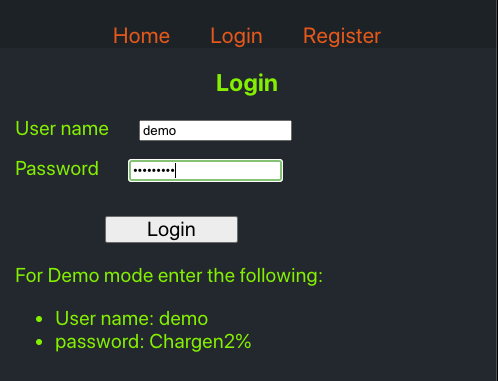
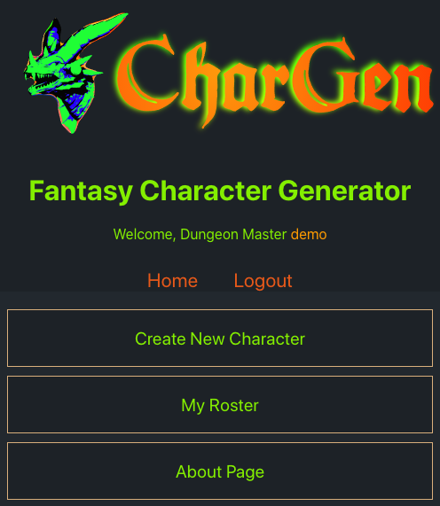
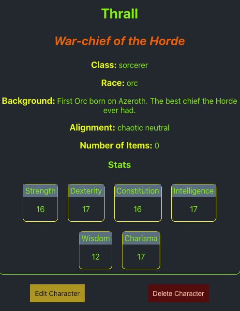
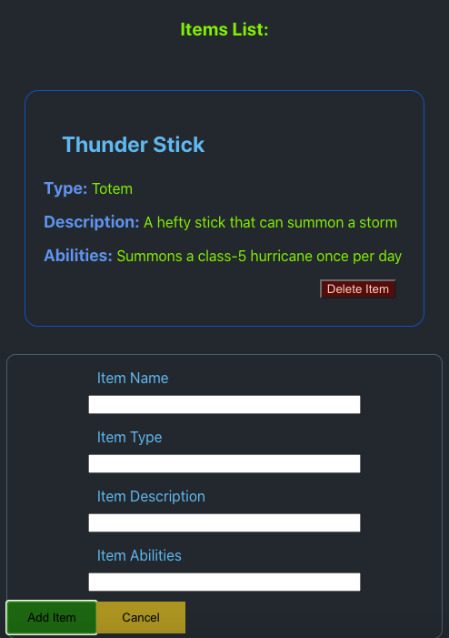

# Chargen

## Fantasy Character Generator (API)

**Description:** Create and store your Dungeons & Dragons characters with this tool. Add as many as you need, edit them, randomize their stats, and add special items to their inventories.

**Link to live app:** [https://chargen-client.vercel.app](https://chargen-client.vercel.app)

**Tech Stack:**

- **Backend** - Node.js - Express - Postgresql
- **Frontend** - React

## Documentation on API

This side of the codebase deals with storing user information and their related characters using a PostgreSQL database. The Character information is stored on a separate table than the Item information. There is a one-to-many relationship between characters and items.

The Express Router is divided into three routes

1.  Characters
2.  Items
3.  Users

The user authentication system is also handled in this codebase. It uses a JWT and the passwords are securely hashed when going into the database. See the package.json file for a list of dependencies.

## Instructions to Clone:

1. Clone from [Github](https://github.com/warptrail/chargen-client)
2. Set up the client side from this [link](https://github.com/warptrail/chargen-api)
3. Set up your postgres database and run npm migrate
4. Make sure your .env file is set up with proper variable names
5. Run `npm run dev` or `npm start` for the api back-end code
6. Run `npm start` to open the client-side app

## Screenshots:

Login or create a new account first

Go to your main menu

Make edits and review

Add items

